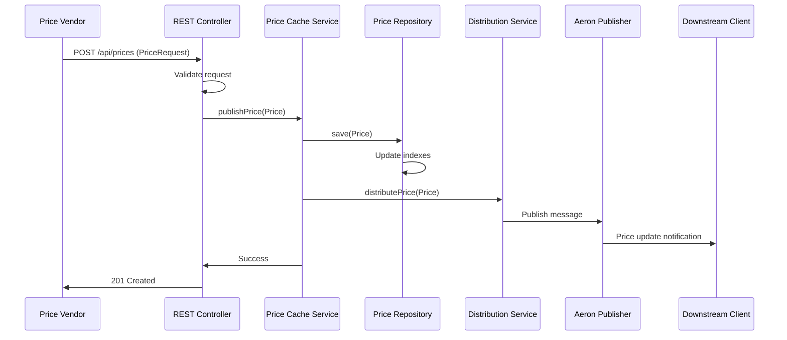
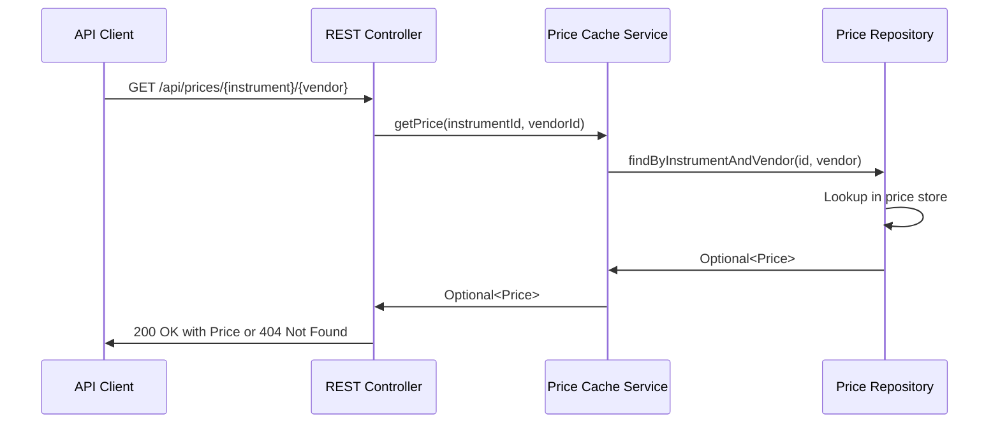
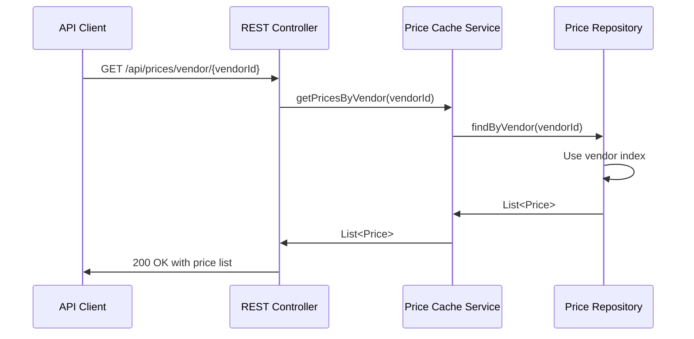
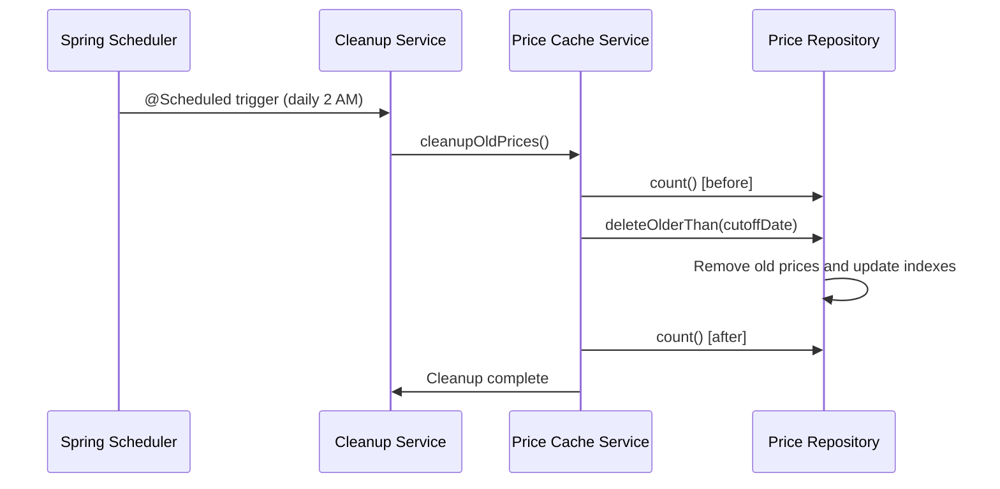
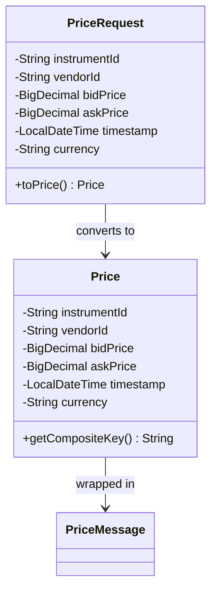
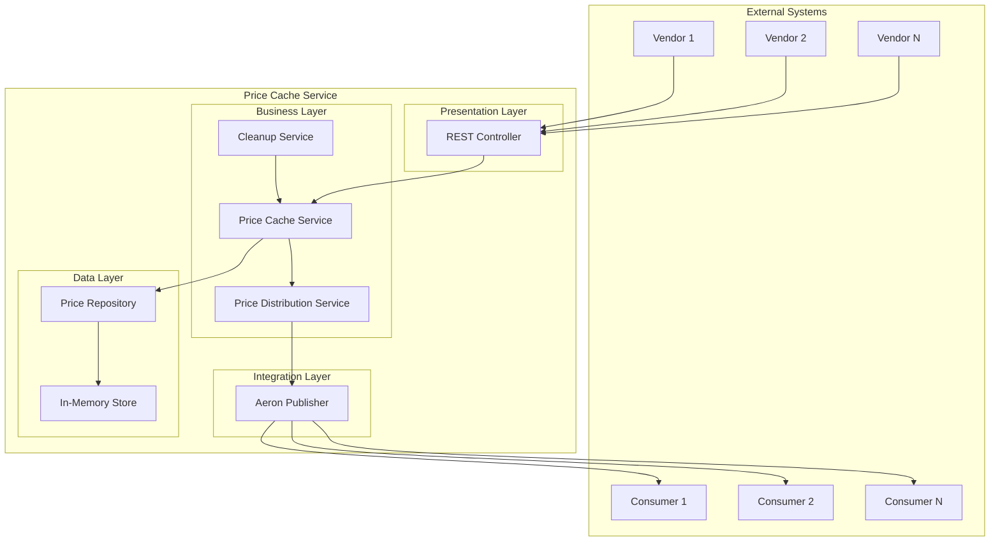

# Matsuri Price Cache Service - Design Documentation

## Table of Contents
1. [System Overview](#system-overview)
2. [Sequence Diagrams](#sequence-diagrams)
3. [Domain Model](#domain-model)
4. [Architecture Design](#architecture-design)
5. [Design Patterns](#design-patterns)
6. [Implementation Details](#implementation-details)
7. [API Documentation](#api-documentation)

## System Overview

The Matsuri Price Cache Service is a high-performance, scalable solution for caching and distributing financial instrument price data from multiple vendors. The system provides:

- **Price Publishing**: Vendors can publish price updates via REST API
- **Price Retrieval**: Clients can query prices by vendor, instrument, or specific combinations
- **Real-time Distribution**: Price updates are distributed to downstream systems using Aeron.io
- **Automatic Cleanup**: Prices older than 30 days are automatically removed
- **High Performance**: In-memory storage with O(1) lookups and efficient indexing

## Sequence Diagrams

### 1. Price Publication Flow

### 2. Price Retrieval Flow

### 3. Bulk Query Flow

### 4. Cleanup Process Flow

## Domain Model

### Core Domain Objects

### Key Design Decisions for Domain Model

1. **Immutable Price Objects**: The `Price` class is immutable to ensure thread safety and prevent accidental modifications
2. **Composite Key Strategy**: Using `instrumentId_vendorId` as a composite key for efficient lookups
3. **BigDecimal for Prices**: Using `BigDecimal` instead of `double` to avoid floating-point precision issues
4. **Validation at Construction**: Domain rules are enforced at object creation time
5. **Separation of Concerns**: DTOs (`PriceRequest`) separate from domain objects (`Price`)

## Architecture Design

### High-Level Architecture

### Layer Responsibilities

1. **Presentation Layer**: REST API endpoints, request validation, response formatting
2. **Business Layer**: Core business logic, orchestration, price caching rules
3. **Data Layer**: Data persistence, indexing, query optimization
4. **Integration Layer**: External system communication, message distribution

## Design Patterns

### 1. Repository Pattern
**Implementation**: `PriceRepository` interface with `InMemoryPriceRepository`

**Benefits**:
- Abstracts data access logic
- Easy to swap implementations (database, cache, etc.)
- Testable through mocking
- Consistent API for data operations

### 2. Strategy Pattern
**Implementation**: `PriceDistributionService` interface with `AeronPriceDistributionService`

**Benefits**:
- Pluggable distribution mechanisms
- Can add multiple distribution channels
- Easy to test and mock

### 3. Service Layer Pattern
**Implementation**: `PriceCacheService` coordinates between repository and distribution

**Benefits**:
- Centralized business logic
- Transaction management
- Clear separation of concerns

### 4. Data Transfer Object (DTO) Pattern
**Implementation**: `PriceRequest` for API communication

**Benefits**:
- API versioning flexibility
- Input validation
- Decoupling of internal domain from external API

### 5. Observer Pattern / Pub-Sub (via Aeron)
**Implementation**: Aeron-based message distribution

**Benefits**:
- Loose coupling between publishers and consumers
- Scalable event distribution
- Real-time notifications

## Implementation Details

### Thread Safety

1. **ConcurrentHashMap**: Used for all internal storage to ensure thread safety
2. **Immutable Domain Objects**: `Price` objects are immutable
3. **Atomic Operations**: Repository operations are atomic
4. **Aeron Thread Safety**: Aeron handles concurrent publishing internally

###

## API Documentation

API Documentation can be found at http://localhost:8080/swagger-ui.html